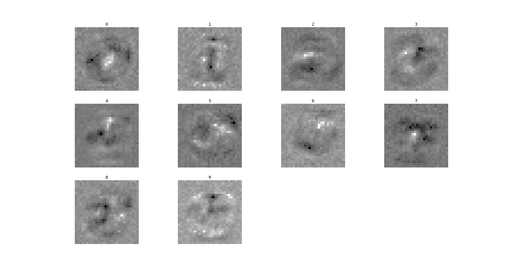

# Neural Network

## Summary

This is an implementation of a general neural network using a logistic activating function,
and back-propagation with stochastic gradient descent. It handles arbitrary numbers of
layers and nodes per layer, but inputs and outputs should be in the range \[0, 1\).

Training and testing were done on the well-known 
[MNIST dataset of handwritten digits](yann.lecun.com/exdb/mnist/)

For a neuron setup of \[784, 100, 10\] (where the array designates neurons per layer),
trained for one epoch on 60,000 MNIST examples, this classifier scores about 95%
accuracy on the 10,000 test examples.

Also features a feed-backward method to visualize the network's behavior. This method
takes in some ideal output and returns the representative input. Here's a sample
image for the full MNIST dataset, after one epoch:

## Credits

This software is based off of Tariq Rashid's excellent book, _Make Your Own Neural Network_.

The CSV version of the full MNIST dataset was downloaded from 
[pjreddie's website](https://pjreddie.com/projects/mnist-in-csv/), while
the toy dataset was downloaded from the _Make Your Own Neural Network_ github.
